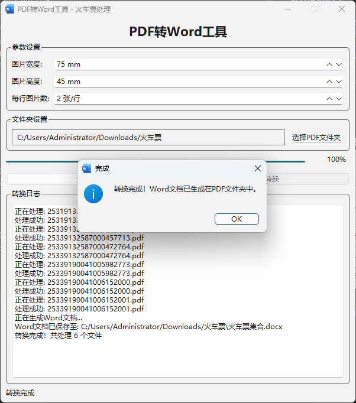
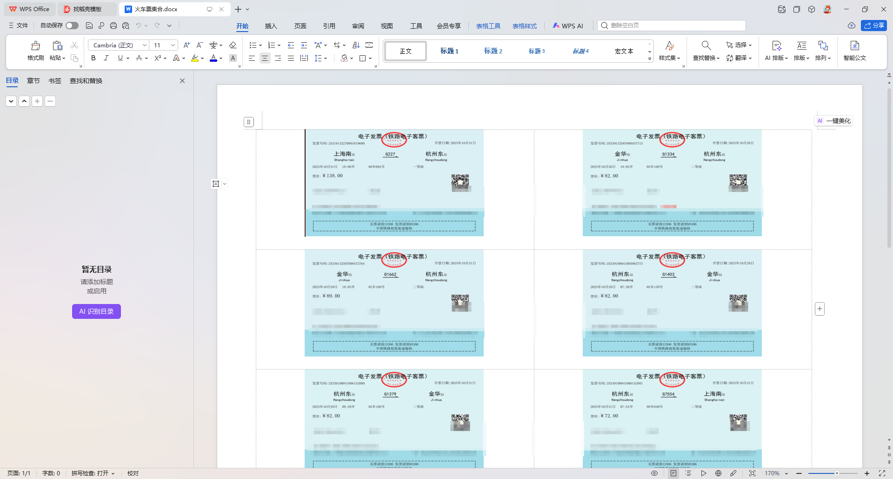

# PDF转Word工具 - 火车票处理

一个专门用于将PDF格式火车票批量转换为Word文档的图形化工具，支持自定义图片尺寸和排版布局。

## 功能特性

- **批量处理**: 一次处理整个文件夹内的所有PDF文件
- **图片优化**: 可自定义输出图片的宽度和高度
- **灵活排版**: 支持设置每行显示的图片数量
- **实时反馈**: 显示转换进度和详细日志信息
- **多线程处理**: 后台执行转换任务，避免界面卡顿
- **可中断操作**: 支持随时停止正在进行的转换

## 界面概览



主界面包括以下几个主要模块：
### 参数设置区域
- `width_spin`: 设置图片宽度(默认75mm)
- `height_spin`: 设置图片高度(默认45mm) 
- `images_per_row_spin`: 设置每行图片数量(默认2张)

### 文件夹选择区域
- `pdf_folder_label`: 显示当前选择的PDF文件夹路径
- `pdf_folder_btn`: 选择PDF文件夹按钮

### 控制按钮区域
- `start_btn`: 开始转换按钮
- `stop_btn`: 停止转换按钮

### 进度与日志区域
- `progress_bar`: 显示转换进度
- `log_text`: 实时显示转换日志信息

## 技术架构

### 核心组件

- **PySide6**: 提供图形用户界面
- **PyMuPDF (fitz)**: PDF文件解析和渲染
- **Pillow**: 图片处理和尺寸调整
- **python-docx**: 生成Word文档

### 主要类说明

#### [ConversionThread](file://C:\Users\Administrator\PycharmProjects\pdf_to_word_tool\pdf_to_word_tool.py#L15-L155) 类
负责PDF转换的核心线程类，继承自 `QThread`：

- [run()](file://C:\Users\Administrator\PycharmProjects\pdf_to_word_tool\.venv\Scripts\bottle.py#L3711-L3729): 主要执行逻辑，遍历PDF文件并调用转换方法
- [convert_pdf_to_image()](file://C:\Users\Administrator\PycharmProjects\pdf_to_word_tool\pdf_to_word_tool.py#L71-L105): 将单个PDF文件转换为指定尺寸的图片数据
- [add_images_to_word()](file://C:\Users\Administrator\PycharmProjects\pdf_to_word_tool\pdf_to_word_tool.py#L107-L152): 将所有图片数据组织成Word文档表格形式
- [stop()](file://C:\Users\Administrator\PycharmProjects\pdf_to_word_tool\pdf_to_word_tool.py#L154-L155): 停止转换过程

#### [MainWindow](file://C:\Users\Administrator\PycharmProjects\pdf_to_word_tool\pdf_to_word_tool.py#L158-L329) 类
主窗口界面类，继承自 `QMainWindow`:

- [init_ui()](file://C:\Users\Administrator\PycharmProjects\pdf_to_word_tool\pdf_to_word_tool.py#L165-L258): 初始化用户界面组件
- [select_pdf_folder()](file://C:\Users\Administrator\PycharmProjects\pdf_to_word_tool\pdf_to_word_tool.py#L260-L265): 处理文件夹选择事件
- [start_conversion()](file://C:\Users\Administrator\PycharmProjects\pdf_to_word_tool\pdf_to_word_tool.py#L267-L296): 启动转换线程
- [stop_conversion()](file://C:\Users\Administrator\PycharmProjects\pdf_to_word_tool\pdf_to_word_tool.py#L298-L306): 停止转换线程
- [conversion_finished()](file://C:\Users\Administrator\PycharmProjects\pdf_to_word_tool\pdf_to_word_tool.py#L19-L19): 转换完成后的回调处理
- [add_log_message()](file://C:\Users\Administrator\PycharmProjects\pdf_to_word_tool\pdf_to_word_tool.py#L318-L323): 添加日志消息到文本框

## 使用流程

1. 运行应用程序
2. 通过"选择PDF文件夹"按钮选择包含PDF文件的目录
3. 根据需要调整图片尺寸和排版参数
4. 点击"开始转换"按钮启动处理过程
5. 观察进度条和日志了解转换状态
6. 转换完成后，结果文件"火车票集合.docx"将保存在原PDF文件夹中

## 安装依赖
```commandline
pip install -r requirements.txt
```
